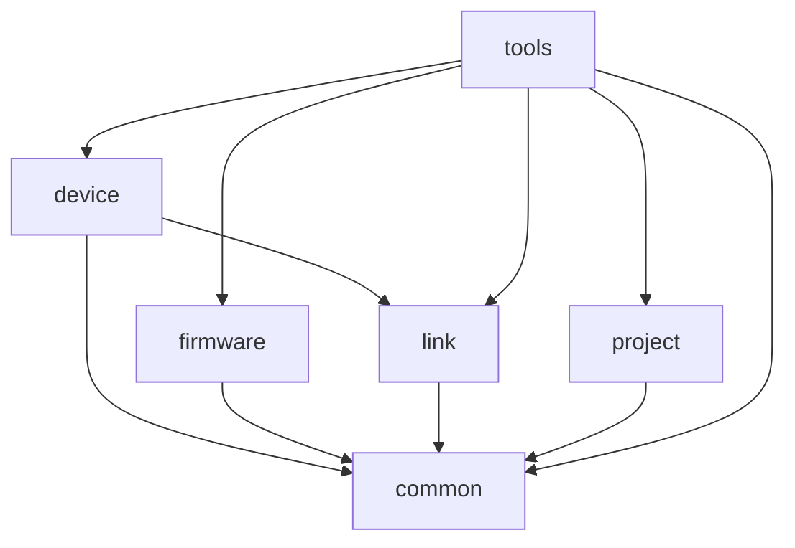

# Jaculus-tools

Monorepo containing libraries and tools for working with Jaculus devices and projects. Individual packages
can be found in the `packages/` directory and are available on npm.

## Packages

- [jaculus-tools](./packages/tools/README.md) ([NPM](https://www.npmjs.com/package/jaculus-tools)) - CLI for working with Jaculus devices and projects.
- [@jaculus/link](./packages/link/README.md) ([NPM](https://www.npmjs.com/package/@jaculus/link)) - Library implementing the Jaculus-link protocol.
- [@jaculus/firmware](./packages/firmware/README.md) ([NPM](https://www.npmjs.com/package/@jaculus/firmware)) - Library for updating firmware on Jaculus devices.
- [@jaculus/project](./packages/project/README.md) ([NPM](https://www.npmjs.com/package/@jaculus/project)) - Library for managing Jaculus projects.
- [@jaculus/device](./packages/device/README.md) ([NPM](https://www.npmjs.com/package/@jaculus/device)) - Library for managing Jaculus devices.
- [@jaculus/common](./packages/common/README.md) ([NPM](https://www.npmjs.com/package/@jaculus/common)) - Common utilities and types used across Jaculus packages.

## Dependencies

